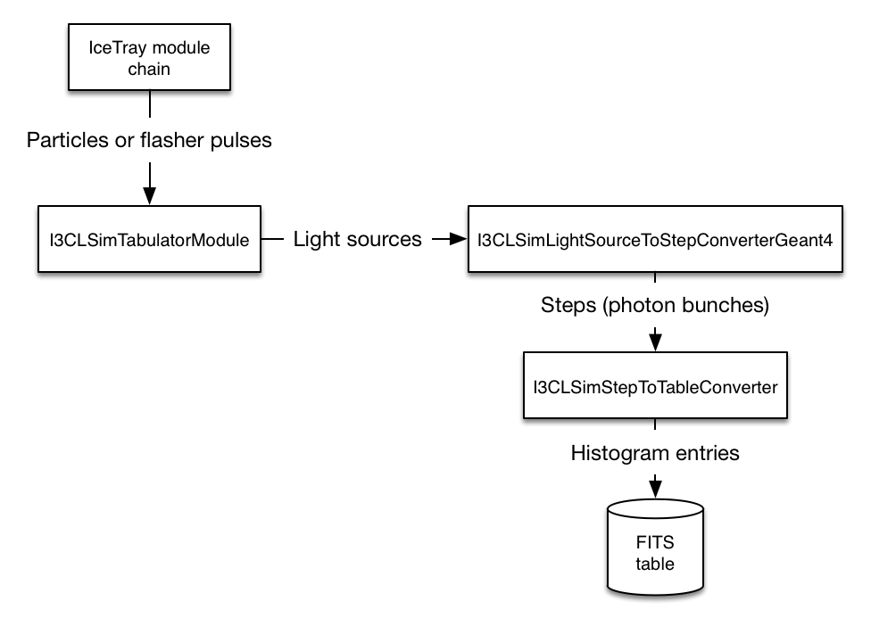

.. 
.. Copyright (c) 2015
.. Jakob van Santen <jvansanten@icecube.wisc.edu>
.. and the IceCube Collaboration <http://www.icecube.wisc.edu>
.. 
.. Permission to use, copy, modify, and/or distribute this software for any
.. purpose with or without fee is hereby granted, provided that the above
.. copyright notice and this permission notice appear in all copies.
.. 
.. THE SOFTWARE IS PROVIDED "AS IS" AND THE AUTHOR DISCLAIMS ALL WARRANTIES
.. WITH REGARD TO THIS SOFTWARE INCLUDING ALL IMPLIED WARRANTIES OF
.. MERCHANTABILITY AND FITNESS. IN NO EVENT SHALL THE AUTHOR BE LIABLE FOR ANY
.. SPECIAL, DIRECT, INDIRECT, OR CONSEQUENTIAL DAMAGES OR ANY DAMAGES
.. WHATSOEVER RESULTING FROM LOSS OF USE, DATA OR PROFITS, WHETHER IN AN ACTION
.. OF CONTRACT, NEGLIGENCE OR OTHER TORTIOUS ACTION, ARISING OUT OF OR IN
.. CONNECTION WITH THE USE OR PERFORMANCE OF THIS SOFTWARE.
.. 
.. 
.. $Id$
.. 
.. @file tabulator.rst
.. @version $LastChangedRevision$
.. @date $Date$
.. @author Jakob van Santen
.. 

The Tabulator
=============

While simulation via direct propagation can be vastly more efficient and
precise than looking up average photoelectron yields from tables, it is
impractical to use the same technique in reconstruction, where the locations of
the light sources are not exactly known. Instead, it is significantly more
efficient to compare the observed photoelectron counts to a table of
precomputed average photoelectron yields for all possible source-receiver
orientations.

In the past such tables were made with Photonics_ and then parameterized with
6-dimensional tensor-product B-spline surfaces using Photospline_. Photonics_
provided a good description of the optical properties of the ice as they were
known at the time, but newly discovered features of photon transport in the
ice, such as the azimuthal anisotropy_ of scattering, are fundamentally
incompatible with its basic assumptions. In order to be able to tabulate photon
detection probabilities including these effects, we have added a tabulation
mode to clsim that is similar to Photonics_, but shares the propagation code
used in clsim's well-tested direct propagation mode. This mode is also
moderately faster than Photonics_ (:math:`\sim 15\%` on typical systems).

.. _Photonics: http://arxiv.org/abs/astro-ph/0702108
.. _Photospline: http://arxiv.org/abs/1301.2184
.. _anisotropy: http://icecube.wisc.edu/~dima/work/IceCube-ftp/ICRC2013/icrc2013-0580-v06.pdf

Quickstart
----------

The main user interface is the following tray segment. The script
resources/tablemaker/photomc.py demonstrates its usage.

.. py:module:: icecube.clsim.tablemaker

.. autofunction:: TabulatePhotonsFromSource

Architecture
------------

The data flow in the tabulation mode is very similar to the direct tracking
mode, except that :cpp:class:`I3CLSimModule` is replaced with
:cpp:class:`I3CLSimTabulatorModule`, which in turn passes photon bunches to
:cpp:class:`I3CLSimStepToTableConverter` instead of
:cpp:class:`I3CLSimStepToPhotonConverterOpenCL`, as illustrated in the flow
chart below. Both of these replacement classes are significantly similar to
their direct-propagation counterparts.

Common components
*****************

As in direct propagation, a few components are needed to describe how photons
are generated, propagated, and detected.

- The *parameterization list* describes the photon emission profiles of various
  kinds of light sources.

- The *spectrum table* is optional, and describes the emission spectra of any
  non-Cherenkov light sources that will be simulated (e.g. LED flashers).

- The *wavelength acceptance* of the DOM describes the quantum efficiency (QE)
  of the receiver, and is used to compute the effective spectrum of detected
  Cherenkov photons. This bears some explanation. In Photonics simulation,
  photons were drawn directly from a Cherenkov spectrum (:math:`\propto
  \lambda^{-2}`) between 300 and 600 nm and then weighted by the QE of the
  receiver when a bin entry was recorded. In our tabulation we instead draw
  photon wavelengths from the QE-weighted Cherenkov spectrum, and skip the
  later QE weighting step, reducing the variance in the final histogram. This
  means that each of our photons represents on average more than one photon in
  the Photonics sampling scheme. The "number of photons" recorded for
  normalization purposes includes a scale factor to account for this.
  
- The *angular acceptance* of the DOM describes the relative sensitivity of the
  receiver as a function of the photon impact angle, and is used to compute the
  photon detection probability each time a photon position is recorded.

- The *medium properties* describe the scattering and absorption
  characteristics of the medium through which photons are being tracked.

Components unique to tabulation
*******************************

.. cpp:namespace:: clsim::tabulator

.. cpp:class:: clsim::tabulator::Axis

	Describes how to map a double-precision coordinate to a bin index. The bins
	are linearly spaced under some transformation supplied by the concrete
	instance of Axis.
	
	.. cpp:function:: Axis(double min, double max, unsigned n_bins)
		
		:param min: the left-hand edge of the first bin (in coordinate space)
		:param max: the right-hand edge of the last bin (in coordinate space)
		:param n_bins: the number of bins. There will be ``n_bins+1`` bin edges.

	.. cpp:function:: double Transform(double value) const
		
		Apply transformation from linear to nonlinear space
	
	.. cpp:function:: std::string GetTransformCode(const std::string &varName) const
	
		Generate OpenCL code that transforms a value from linear to nonlinear space
	
	.. cpp:function:: double InverseTransform(double value) const
		
		Apply transformation from nonlinear to linear space

	.. cpp:function:: std::string GetInverseTransformCode(const std::string &varName) const
	
		Generate OpenCL code that transforms a value from nonlinear to linear space

Currently there are only two concrete implementations of :cpp:class:`Axis`:

.. cpp:class:: clsim::tabulator::LinearAxis

	An axis with a trivial linear scale

.. cpp:class:: clsim::tabulator::PowerAxis

	An axis with bins spaced according to a power
	
	.. cpp:function:: PowerAxis(double min, double max, unsigned n_bins, unsigned power=1)
		
		:param min: the left-hand edge of the first bin (in coordinate space)
		:param max: the right-hand edge of the last bin (in coordinate space)
		:param n_bins: the number of bins. There will be ``n_bins+1`` bin edges.
		:param power: the power of the transformation (e.g. 1 for linearly spaced
		              bins, 2 for quadratically spaced bins, 3 for cubic, etc)

.. cpp:class:: clsim::tabulator::Axes
	
	A description of the coordinate system of the photon detection probability table
	
	.. cpp:function:: Axes(const std::vector<boost::shared_ptr<clsim::tabulator::Axis> > &axes)
	
	.. cpp:function:: std::string GetCoordinateFunction() const
	
		Generate an OpenCL function that calculates the source-relative
		coordinates from the photon position and time
	
	.. cpp:function:: std::string GetBoundsCheckFunction() const
	
		Generate an OpenCL function that returns true if the photon has exited
		the recording volume and should be stopped
	
	.. cpp:function:: double GetBinVolume(const std::vector<size_t> &multiIndex) const
	
		Calculate the volume in cubic meters of a histogram bin.
		
		:param multiIndex: a vector of bin indices in each dimension.

Currently there are two concrete implementations of :cpp:class:`Axes`:

.. cpp:class:: clsim::tabulator::SphericalAxes
	
	Spherical, source-centered coordinates, appropriate for approximately
	point-like emitters.
	
	The dimensions are:
	
	- *radius*: distance (meters) from the position of the reference particle
	  (i.e. length of the displacement vector)
	
	- *azimuth*: angle (degrees) of rotation of the displacement vector around
	  the reference particle direction, measured w.r.t. a vector perpendicular
	  to the reference particle pointed towards positive z (:math:`\vec{\rho}`
	  in Fig. 1 of the Photonics_ paper). The range from 180 to 360 degrees is
	  mirrored onto 0 to 180 degrees.
	
	- *polar angle*: cosine of the opening angle between the reference particle
	  direction and the displacement vector.
	  
	- *time residual*: difference (in nanoseconds) between the photon detection
	  time and the straight-line time from the reference particle position at
	  :math:`c/n`. The reference time is calculated using the *smallest* group
	  index of refraction in the wavelength range covered by the ice model to
	  ensure that time residuals are always positive.

.. cpp:class:: clsim::tabulator::CylindricalAxes

	Cylindrical coordinates centered on the axis of the source, appropriate for
	infinite-ranged particles moving at the speed of light (e.g. an
	approximation to high-energy muons).
	
	The dimensions are:
	
	- *perpendicular distance*: distance of closest approach of the source to
	  the receiver position (length of the :math:`\vec{\rho}` vector in Fig. 1 of
	  the Photonics_ paper).
	
	- *azimuth* angle (radians) of rotation rotation of the displacement vector
	  around the reference particle direction.
	
	- *z*: IceCube z coordinate of position of closest approach of the source
	  to the receiver position.
	
	- *time residual* difference (in nanoseconds) between the photon detection
	  time and the earliest possible Cherenkov photon arrival time. This is
	  given by the to move along the source direction at the speed of light and
	  then to the receiver at the local speed of light at the Cherenkov angle.
	  This time is calculated using the smallest index of refraction.

Open issues
-----------

- All coordinate systems cover only half of the sphere/cylinder (like in
  Photonics). This is fine as long as the medium is symmetric under reflections
  across the plane containing :math:`\vec{\rho}`, which can only be true for
  all :math:`\vec{\rho}` if the medium is symmetric around the z axis. To fully
  capture the azimuthal asymmetry, we have to record in the full volume and
  make tables for sources from all azimuths.

- For cascades the center of the spherical coordinate system is the cascade
  vertex, not the shower maximum. While physically correct, this is different
  from the reference point in Photonics simulation, where the shower was
  compressed down to a point.

- There are no over- or under-flow bins. For dimensions like azimuth or polar
  angle that cannot be out of range this is fine, but is a bit wrong for e.g.
  radius.

- The DOM is currently treated as point-like, i.e. the point at which the
  photon is recorded is identical to center of the DOM. At source-receiver
  distances much larger than the DOM radius this is clearly negligible, but it
  might make a difference at very close range. It might be possible to fix by
  displacing the point at which the photon is recorded to the center of a
  sphere (or more properly, hemisphere) that intersects the current recording
  point.

- There's no way for the user to directly set the number of photons to be
  propagated. The step generators would need to gain some concept of a prescale
  to make this happen.
